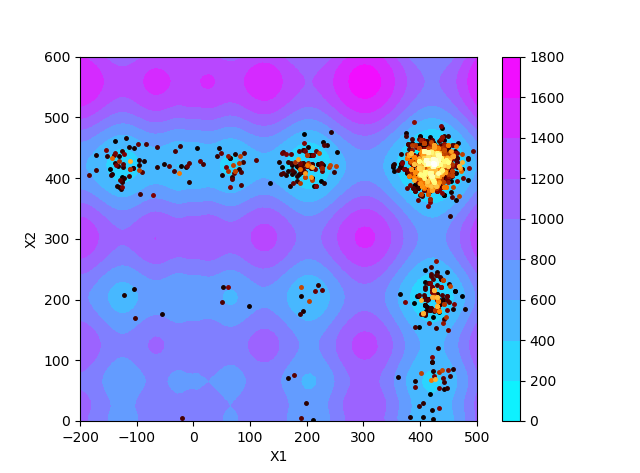
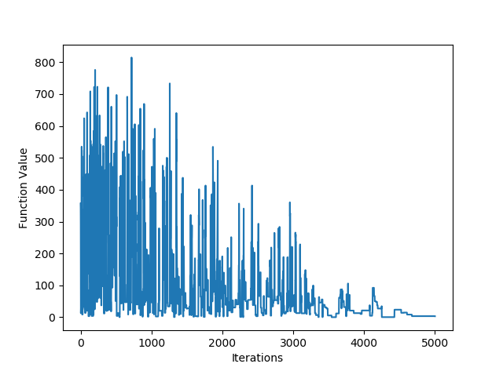

# Simulated Annealing within Python
Simulated Annealing is implimented over an arbitary number of dimensions, and included are utilities for plotting the optimization trajectory as well as function value over time.

## Simulated Annealing Background
Simulated Annealing is the first stochastic optimization algorithm I have implimented on Python, with it being one of the simplest (initially in it's conception, however many alterations have been added over the years).  

-Describing the basic algorithm:
The algorithm starts at an initial 'temperature' 

A random 'point' (set of coordinates in 'd' dimensions) is created within the bounds of the function space. 

The function is then evaulated at this point and the point is stored as the 'best' point (as it is the only point). 

Another random point is created and again the function is evaulated on this point, now one of two things can happen. 

First: if the value of the function at the new point is less than the value of the function at the old point (previously the best point), then the new point is then stored as the best point. 

Second: if the value of the function at the new point is greater than the value of the function at the best point, then the new point *might* be accepted at the new best point. 
Initially this will seem counter intuitive: *if the value of the function is greater and the objective is to minimize the function why would you want the larger value?* 

However it is this feature of the simulated annealing algorithm which allows it to escape local minima, converging on the global optimum (mostly- discussed later). 

The new *larger* point can be accepted as the new best point with probability: .gif)

The 'temperature' is then decreased by an amount, and the process repeated. 

As the temperature starts high and then decreases, this results in the best point initially bouncing around the search space, exploring all possibilities. Then as the temperature decreases, the probability of accepting a worse point decreases and the algorithm should (given a large enough initial temperature, and slow enough cooling rate) converge on the global minima.

### Limitations of current implimentation
In the current implimentation, the temperature decrease per iteration is defined as a constant value throughout the annealing schedule. This is known as a *linear* cooling regime. Adaptive simulated annealing allows the temperature to decrease as a function of the algorithm progess.

### Prerequisites

Python 3.0 is required. The PlottingUtility.py file must be in the same file as the SimulatedAnnealing.py file in order to enable the utility to be used to plot the trajectory of the function as well as a 2D contour.

## Function Use
```
INPUTS
    bounds : bounds on the function to be optimized, must be in the form [[x1,x2],[x3,x4]...]
    f      : function to be optimized
    temp_it: iterations per temperature
    t      : initial temperature
    td     : temperature decrease per iteration
    plot   : Set to true to display plotting utilities (Only valid for 2 variables)
    contour: Set to true to display a contour plot underneith trajectory (Only valid for 2 variables)
    
OUTPUTs
    p_best : optimal point
    f_best : function value at optimum point
 ```

## Example

With the PlottingUtilities.py, SimulatedAnnealing.py and TestFunctions.py files within the same directory.
Running the following:
```
SimulatedAnnealing([[-200,500],[0,600]],tf.Schwefel,20,100,0.02,plot=True,contour=True)
```
Produces the following outputs:
```
Optimum at: [423.4364436349647, 425.21396324812764]
Function value at Optimum: 3.044639708296245
```

- 
 
-

    
## Authors

* **Tom Savage** - *Initial work* - [TomRSavage](https://github.com/TomRSavage)
